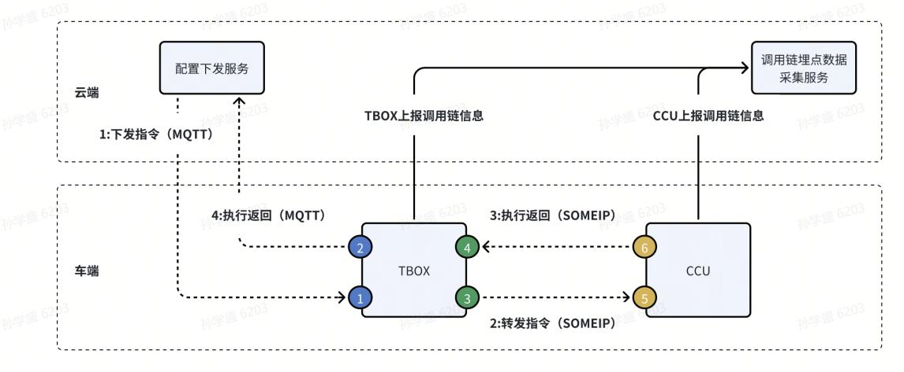

### 1.用户操作消息体
```json
{
//消息体，用户操作消息
"tag": 1,   // 埋点数据类型
"timestamp": 1647253105799, // 事件时间
"event_type": 201,  // 事件类型
"app_name": "air_condition",    // 应用名称
"event_id": "air_condition_switch_click",   // 事件名称
"event_value": {
"click": "on"
}
}
```
* event_value 中的"键"是“click”，为 string 类型；"值"是“on”，为 string类型。

### 2.系统资源消息体
```json
{
//消息体，系统资源消息
"tag": 2,
"timestamp": 1647253105799,
"sample_time": 10,
"event_value": {
"cpu_load_max": "70%",
"memory_load_max": "60%",
"storage_load_max": "80%",
"cpu_load_avg": "30%",
"storage_load_avg": "40%",
"network_load_max": "90%",
"network_load_avg": "50%",
"max_cpu_time": " 164725314857",
"max_memory_time": "1647253105799",
"max_cpu_app": "app1=50%;app2=30%;app3=10%",
"max_memory_app": "app4=40%;app5=35%;app6=15%"
}
}
```

### 3.故障信息消息体
```json
{
//消息体，故障信息
"tag": 3,
"service_id": "0x10C0",
"service_interface_id": "0x0001",
"fault_time_stamp": 1647253105799,
"fault_code": 51380242,
"fault_string": "大数据预处理文件压缩故障",
"fault_reason": "unable to locate the component",
"fault_detail": ""
}
```

### 4.调用链消息体
调用链消息上报场景有三种：
- 

调用链信息上报场景一：TBOX 作为服务端，上报云端指令下发执行的链路信息
```json
{
//消息体，故障信息
"tag": 4,
"event_time_stamp":[1647253101736,1647253107737],//TBOX 收到云端指令的时间[图示节点 1],TBOX 将执行结果返回云端的时间[图示节点 2] 
"message_id": "2ac52802079044368e3f66d5f8b81c0f.45.16684856669727683",//云端下发的 traceid 
"client_id": "",
"send_type": 3,//MQTT 服务端
"execution_state": 0
}
```

调用链信息上报场景二：TBOX 作为客户端，上报将云端指令转发给 CCU 执行的链路信息
```json
{
//消息体，故障信息
"tag": 4,
"event_time_stamp":[1647253102736,1647253105737],//TBOX 转发云端指令的时间[图示节点 3],TBOX 接收到 CCU 执行结果的时间[图示节点 4] 
"message_id": "0x10C0,0x0001",//{serviceID}+“,”+{methodID} 
"client_id": "0x1502",//SOMEIP 中的 ClientID 
"send_type": 0,//SOMEIP 客户端
"execution_state": 0
}
```

调用链信息上报场景三：CCU 作为服务端，上报接收指令后执行的链路信息
```json
{
//消息体，故障信息
"tag": 4,
"event_time_stamp":[1647253102736,1647253105737],//TBOX 转发云端指令的时间[图示节点 3],TBOX 接收到 CCU 执行结果的时间[图示节点 4] 
"message_id": "0x10C0,0x0001",//{serviceID}+“,”+{methodID} 
"client_id": "0x1502",//SOMEIP 中的 ClientID 
"send_type": 0,//SOMEIP 客户端
"execution_state": 0
}
```

### 5.自定义消息体
```json
{
//消息体，用户操作消息
"tag": 1,   // 埋点数据类型
"timestamp": 1647253105799, // 事件时间
"event_type": 201,  // 事件类型
"app_name": "air_condition",    // 应用名称
"event_id": "air_condition_switch_click",   // 事件名称
"event_value": {
"click": "on"   //自定义字段(键值对形式)
}
}
```